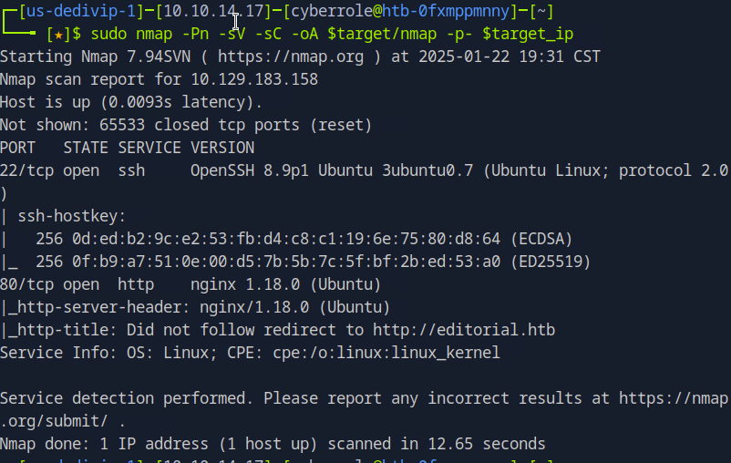

In this post, I’ll walk you through my enumeration and exploitation process of the 'Editorial' machine on Hack The Box. The goal is to gain access to the system by finding and exploiting vulnerabilities, all while documenting each step.

<!--more-->

## 1. Summary

{}
Editorial is a machine on Hack the Box using nginx and Flask to serve a book publishing website. The absence of proper input validation in the URL field leads to a successful sever-side request forgery (SSRF) attack. SSRF is an attack in which a hacker can submit an unauthorized HTTP requests to gain access to resources that are not normally made available to the public.
{}

## 2. Enumeration

My first step in tackling this machine is setting up my workspace environment with variables and note files. This allows me to efficiently reuse static information across multiple scripts to enumerate the target machine. In addition, creating note files allow me to organize relevant information.

> [!NOTE]
> Please be aware that I am storing sensitive information plainly only for the sake of this blog. In a real penetration test, sensitive information such as credentials will need to be stored securely using a credential manager or applications with similar functionality.

```bash
# Workspace Setup
target='editorial'
mkdir $target
touch $target/creds.txt
touch $target/computers.txt
target_ip='10.129.183.158'
```

### A. Network Enumeration

After setting up my workspace, I perform an nmap scan to look for open ports and map their services.

```bash
# nmap scan with version and script detection (-sV, -sC) on all ports (-p-)
sudo nmap -Pn -sV -sC -oA $target/nmap -p- $target_ip
```

- `Pn`: Skip host discovery.
- `sV`: Version detection.
- `sC`: Run default scripts to detect common vulnerabilities.
- `oA`: Output to all formats.



The scan reveals port 22 and port 80 open. As mentioned in my earlier article, Nibbles, this indicates that the host allows for remote connections through SSH on port 22 and is hosting a webpage at [http://editorial.htb](http://editorial.htb) on port 80.

### B. Web Application Enumeration

Since I am working with a web server, I add the host to my /etc/hosts file in order to use its URL instead of its IP address. This is useful for interacting and testing the web server directly.

```bash
# Adding domain to /etc/hosts
target_domain="${target}.htb"
echo -e "${target_ip} ${target_domain}" | sudo tee -a /etc/hosts
```

Following this step, I check for easily exploitable vulnerabilities by enumerating the tech stack and by checking for existing sitemaps and robot files. These two files can help quickly determine hidden directories and pages without the need to enumerate them using a specialized tool such as gobuster which generates a lot of network traffic.

```bash
# Checking the web application tech stack
whatweb $target_domain
```

The command `whatweb` is useful for this situation. It is a command used to identify the technology and frameworks a website is using, helpful in identifying possible attack vectors. It shows the application using nginx, a server software with HTTPS server capabilities.


After learning that the site is using nginx, I move forward by visiting checking [http://editorial.htb/sitemap.xml](http://editorial.htb/sitemap.xml) and [http://editorial.htb/robots.txt](http://editorial.htb/robots.txt) in a browser. Both return a 404 HTTP error. The error is associated with “Page Not Found” and can be interpreted as the resource not found at the specified address (not necessarily that it does not exist). One notable thing about both 404 pages is that they are distinctive. From personal experience, I know the web development framework, Flask uses these pages. This leads me to believe the site is using Flask.


Base on this infomration, I deduce that the host is using nginx, Flask, and most likely Python.

Next, I visit the root URL and learn that it is a site for a publishing company. I click through the available links on the site to see what else I can learn about the application. I find an About page, [http://editorial.htb/about](http://editorial.htb/about) with a contact email address and make a mental note of it. There may be the possibility of having to make a phishing attempt.


After I finish with the about page, I visit the upload page, [http://editorial.htb/upload](http://editorial.htb/upload). It appears to be a form for users to submit publication requests with this mock company, Tiempo Arriba. The form allows a user to submit a book cover via a URL address or a file upload. Upload pages are prime targets for exploitation. If input is not properly sanitized, it can lead to the system being compromised.


With the web application enumerated, the next step is to test for potential vulnerabilities, specifically by focusing on the file upload feature and its interactions with URLs.

I open up Burp Suite to capture the form’s responses and replay any requests as needed. Since I only want to analyze traffic associated with the target system, I define my scope within Burp Suite and add its IP address to the scope menu. Next, I open up the Proxy tab and ensure Intercept is enabled.


Following that, I download a book cover to my workspace. I set my proxy so that the traffic passes through the default proxy address for Burp Suite, 127.0.0.1:8080.


I then proceeded to upload it to the portal using the `Preview` button. Burp Suite captures the submission as a POST request with the parameters bookurl and bookfile. Next, I forward the request to Repeater tab so I can monitor the responses.


Noticing that the source information is captured, I use the Google URL for the book cover to test the bookurl field to avoid disclosing my own host as the source.


Each submission, generates a random filename for the site to use to generate its previews in the HTTP response.

By observing that the form allows URLs to be input and renders images based on those URLs, I hypothesize that the application might be vulnerable to server-side request forgery (SSRF). While, I can fuzz the application on every port using Burp Suite or tools such as ffuf, doing so will generate a large amount of network traffic and noise. For now, I test this by targeting common internal ports used for development and administration services, port 3000, 5000, and 8080. Since I know the target system is using nginx and most likely using Flask, I begin my attack on port 5000.

## 3. Exploitation

I turn off my proxy in case I need to test port 8080. Then, I enter [http://127.0.0.1:5000](http://127.0.0.1:5000) and click `Preview`. Unlike my earlier attempts, instead of a proper image, the application renders a broken image icon. I right click on it and open it in a new tab to render it properly. However, instead of an image, a download prompt opens.


I download the file and analyze it using the command utility `file` to determine the type of file downloaded.

```bash
file 26e9060e-5156-4b8f-8b70-fc35c2341c5f
```

`file` shows that I downloaded a JSON file.


To read JSON files, I pipe the output from `cat` to `jq`. `jq` is a command-line JSON processor. It makes it easier to parse and analyze JSON data from server responses.

```bash
cat 26e9060e-5156-4b8f-8b70-fc35c2341c5f | jq
```


It prints reference information for an api endpoint for the application.

Out of all the results, the `new_authors` GET request and the `version` GET request interest me the most as they can provide information that can lead to a vulnerability or default credentials for new accounts. I submit another request to the application and save the file as `author` and view its contents

```bash
cat author | jq
```


Now that I have some credentials, I add it to my creds.txt file and proceed to test it using SSH to see if the credentials have been recycled.

```bash
# Adding the found credentials to the creds.txt file
sudo vim creds.txt
dev:dev080217_devAPI!@
```

Next I connect to the host remotely using `ssh`.

```bash
ssh dev@$target_ip
```

I successfully log onto the host as dev


## 4. Initial Foothold

With access to a system account, I first check what the user `dev` can run with elevated privileges using `sudo -l`.


It doesn’t appear that I can run sudo as the user, dev. However, I can still use the account to begin exploring directories, files, and the system to search for potential privilege escalation vectors.

```bash
# Checking for users on the host
cat /etc/passwd
```


The non-standard users in `/etc/passwd` are `prod` and `dev`. Custom users, especially those with user IDs (UID) and group IDs (GID) above 1000, may indicate specific roles in the system, such as development and production environments. After reviewing the accounts on the system, I list the contents of the current user’s home directory to gather additional information.

```bash
# Checking current user's home directory
ls /home/dev
```


I grab the user flag


Next, I inspect the `apps` directory. It is suspiciously empty so I add the option `-a` to show hidden directories.


I find the `.git` directory. Hidden `.git` directories can review sensitive information such as commit history, code, or configuration details that can aid in privilege escalation.

Since the `.git` directory is on the system, I use the `git` command to start enumerating its contents. I begin with `git log` to review the commit history.

```bash
# Checking the commit history
git log
```

I see a commit where the host was once downgraded the dev environment.


I hypothesize that if I can revert the host to a dev environment, there’s a good chance I can escalate my privileges since development environments tend to not be as secure as production environments. I check the commit using the command `git show`.

```bash
git show b73481bb823d2dfb49c44f4c1e6a7e11912ed8ae
```

The commit reveals and email with the prod user credentials in plain text, which I store it to my `creds.txt` file for later use. From here, I decide to pivot to the user, prod to see if it is a higher privilege account than dev.


## 5. Privilege Escalation

I pivot to prod using the `su` command. The `su` command allows me to switch users without the need to exit my current session. Doing so allows me to enumerate the host further.

```bash
# Switching users
su prod
```


I check for commands that I can run as the user `prod` using `sudo -l`.

```bash
# Checking sudo privileges
sudo -l
```


In doing so, the output reveals the presence of a Python script, `clone_prod_change.py` that can be ran as root using `sudo`. It uses the Python Repo library from git.


I search for it on Google using “git import Repo vulnerability.” I open the first couple of links and read about it. I learn that the `Repo` library has a known vulnerability that allows for commands to be ran that are not git specific in the same line of code. In particular, the `ext::sh`notation allows a `git` user to run shell commands within git context. With this information, I can leverage the script to copy the contents of root flag from the `root` directory to a more accessible directory, `tmp`using the `cat` command.

```bash
sudo /usr/bin/python3 /opt/internal_apps/clone_changes/clone_prod_change.py 'ext::sh -c cat% /root/root.txt% >% /tmp/root.txt'
```

The script generates an error, “Could not read from remote repository” because it is not accessing a GitHub repository. However, the error does not impact the shell command and it is executed.


The root flag is copied to the `tmp` directory.


I read the contents of the root flag and capture it.

```bash
cat /tmp/root.txt
```


## 6. Conclusion

Through this exercise, I successfully exploited the SSRF vulnerability present in “Editorial”, which led to privilege escalation and capturing the root flag. The key techniques involved in this process included identifying vulnerable functionality in the upload feature, leveraging Burp Suite to intercept and analyze HTTP responses, and exploiting the Python `Repo` library to execute arbitrary commands using the `ext::sh` syntax.
