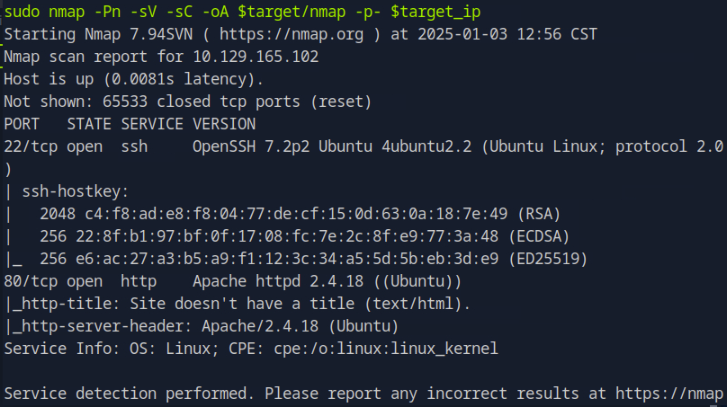

This write-up is for the Hack the Box machine, Nibbles released on January 13, 2018.

<!--more-->

## 1. Summary

Nibbles is a HackTheBox host serving a blog using the Nibbleblog content management system (CMS). The CMS prior to version 4.0.5 contains a flaw that allows an authenticated user to upload executable files with malicious code using the “My Image” plugin. This vulnerability grants an attacker the ability to execute commands remotely. More information about the vulnerability can be found in [CVE-2015-6967](https://nvd.nist.gov/vuln/detail/CVE-2015-6967).

While the plugin itself is only accessible through the admin portal, the admin account is protected with a weak password. Guesswork allows an attacker to easily access the plugin and exploit it. That said, Nibbles demonstrates the need for using strong passwords and ensuring uploaded files are properly sanitized.

Below I demonstrate how I conquered this box.

## 2. Enumeration

### A. nmap

To start, I set up my project variables and plan to gather as much information about the host as possible to determine the best entry point. I initiate an nmap scan on the host for open network ports and their services.

```bash
# Project setup
target='nibbles'
mkdir $target
touch $target/creds.txt
touch $target/computers.txt
target_ip='10.129.166.102'

# nmap scan with version and script detection (-sV, -sC) on all ports (-p-)
sudo nmap -Pn -sV -sC -oA $target/nmap -p- $target_ip
```

The -Pn flag disables host discovery (useful for avoiding firewall filters). -sV is for service version detection, and -sC runs default nmap scripts for additional information gathering. -oA tells nmap to output to an .xml file, grepable file, and the default format. Finally, -p- is to scan all 65,353 ports.



### B. Web Server Enumeration

Knowing that I am working with a webserver, I add the domain to /etc/hosts. The common domain naming convention in HTB is a combination of the machine name and the domain .htb. In this case, it is nibbles.htb. In doing so, I can now use nibbles.htb instead of the IP address, which is useful for testing and interacting with the web server directly.

```bash
target_domain="${target}.htb"
echo -e "${target_ip} ${target_domain}" | sudo tee -a /etc/hosts

# gobuster wordlists
dir_wordlist='/usr/share/wordlists/seclists/Discovery/Web-Content/raft-medium-directories-lowercase.txt'
common_wordlist='/usr/share/wordlists/seclists/Discovery/Web-Content/common.txt'
```

I then launch a browser and visit the URL for the host, nibbles.htb. The page finishes loading and I see “Hello world!”. To me, this means the site is incomplete or there is something hidden from plain sight. Knowing this, I check the site’s source code. In there, I confirm my suspicions when I see an HTML line commented out. It is pointing to a subdirectory named nibbleblog.


Visiting the subdirectory loads a blog with some dead links. The only thing that seems to be of interest is the “Powered by Nibbleblog” text in the bottom right corner. So I search for it on Google and find the Github repository for Nibbleblog. I spend some time reviewing the repository in hopes of finding useful information. I learn that the CMS is using PHP, but did not find credentials. Unable to find a potential vulnerability, I move into the next phase, directory enumeration to see if I can find any useful information that is different from the repository.

Since the CMS (Nibbleblog) may have hidden administrative or configuration files, I use gobuster to enumerate possible subdirectories and files that could lead to sensitive information or vulnerabilities. However, none of the results surprise me because much of it is the same as what I found in the Github repository. The two wordlists used in the one-liner have been ones that I have had the most success on HTB.

### C. Hidden Directory Enumeration

```bash
# Searching for hidden subdirectories
gobuster dir -w $dir_wordlist -u $target_domain/nibbleblog --exclude-length 0
```


```bash
# Searching for hidden files using file extensions
gobuster dir -w $dir_wordlist -u $target_domain/nibbleblog -x .txt,.MD,.php,.xml --exclude-length 0
```


After exploring the source code and navigating through the blog, I identify some interesting files and URLs that could be useful for further enumeration such as admin.php,, install.php, and update.php. I will now explore these files to uncover further potential entry points.

The first file, admin.php, loads a web form to what I assume to be the admin panel. Rather than rushing into a brute force attack, which could trigger rate-limiting or IP blocking, I choose to explore other reconnaissance methods first. In real-world scenarios, these proactive measures are crucial to avoid tipping off intrusion detection systems and to conserve resources for when brute-forcing becomes necessary.


Visiting: [http://nibbles.htb/nibbleblog/update.php](http://nibbles.htb/nibbleblog/update.php) reveals CMS name and version: Nibbleblog 4.0.3


Visiting the Config.xml file reveals the admin email, admin@nibbles.com


Visiting the user.xml file reveals the username admin and what appears to be a counter for failed login attempts. At this point, it’s safe to assume there is a limitation to the number of failed attempts that can be made before failed attempts from the same IP address will be blocked.


After thoroughly investigating the available information and resources, I turn to Searchsploit to check for known vulnerabilities in the Nibbleblog CMS version 4.0.3 found on the target.


The tool shows a Metasploit module available for the version of our CMS. For those unfamiliar with it, Metasploit is a widely used tool for performing security assessments. After reviewing the its description and code, we learn that the plugin, “My Image” included with the CMS can be exploited and allow for authenticated remote code execution (RCE) through a file upload. However, exploiting this vulnerability requires admin-level access.


## 3. Exploitation

After extensively enumerating the host to uncover sensitive information, it appears that my only option now would be to attempt a brute force attack on the admin panel. I begin with the most common combinations of default admin credentials: admin:admin and admin:password. Both attempts fail.


One thing that I have learned is that most applications will use the name of the application itself as the default password. In this case, “nibbles.” I enter it and success!


### A. Metasploit

After obtaining the admin credentials, I launched Metasploit. First, I searched for the Nibbleblog exploit using search nibbles. This returned a single exploit available or Nibbleblog. I then used the command use 0 to select it and then configured the necessary parameters such as the target and the default credentials.

```bash
# Running Metasploit without Banner using the q flag and searching for nibbles
msfconsole -q
```


It successfully runs and after a moment, I am now connected to the host in the “My Image” plugin directory. I drop into a shell and learn that I am connected as the user, nibbler.


I begin by nibbler’s user information to see if there is anything I could abuse from the start. From the output, I can see nibbler is just a standard user on the host. Since the Metasploit shell, Meterpreter, has somewhat limited functionality I upgraded my shell using Python. This makes it easier to run commands and to navigate the system without encountering common issues associated with non-interactive shells.

```bash
# Using the Python pty library to spawn a shell
python3 -c 'import pty;pty.spawn("bin/sh")'
```


After I complete that step, I begin enumerating basic information on the host. To determine if I need to move laterally on this host, I check the /home directory. There are a variety of ways to determine other users, this is just one method. Seeing that nibbler is the only user with a home directory, I navigate to read the contents of the user flag. I run ls just in case it is not there. I confirm that it is there with an additional file, personal.zip.


I view the contents of user.txt to obtain my first flag. Now it’s time to find a way to escalate privileges in order to view the contents of the root.txt flag.


## 4. Privilege Escalation

To check for potential privilege escalation opportunities, I ran the sudo -l command. This reveals any commands that the current user can run with elevated privileges. In this case, I discovered that the user could run the [monitor.sh](http://monitor.sh) script with root privileges, which might be an avenue for escalating to root. Judging from the output, the monitor.sh is located in the personal/stuff subdirectory which is likely part of the personal.zip file found earlier.

```bash
# Checking sudo permissions
sudo -l
```


Before I run the script, I confirm that I am unable to view root folder contents.


I also check the level of access the user nibbler has on the [monitor.sh](http://monitor.sh) script by running ls -l on the file to list its permission. The results show that everyone has read, write, and execute permission on it. Since a copy already exists in the personal.zip file, I’m not concerned with overwriting its contents. I overwrite the file with the command to read the contents of the root.txt file and run it to obtain the flag.


## 5. Conclusion

Through this exercise, I was able to simulate a full penetration test scenario demonstrating the importance of reconnaissance, identifying vulnerabilities, and escalating privileges to gain full control over a compromised host. The process also highlighted how default credentials, improper configuration, and unpatched vulnerabilities can often be the easiest route to a system compromise.
